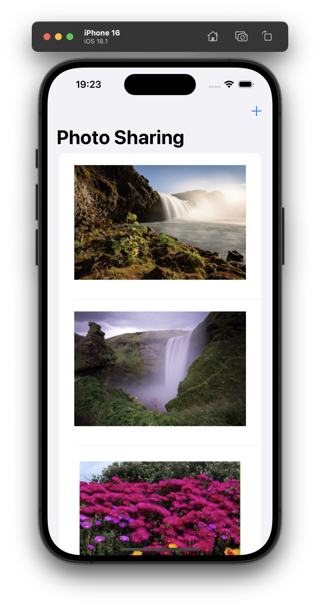
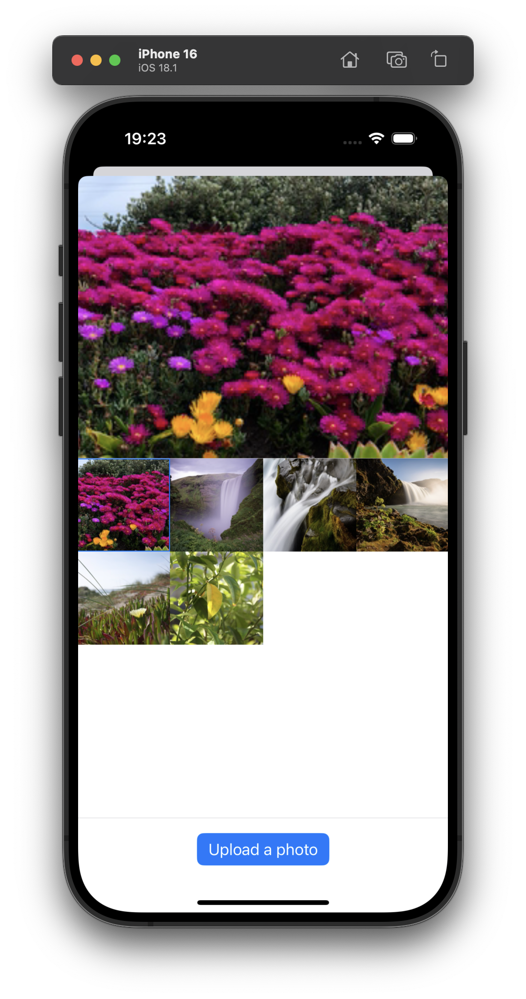

 
 
 
 

# Photo Sharing App

## Overview
This is a simple photo sharing app built using SwiftUI and Combine. The app allows users to view a list of photos, upload a new photo with a description, and see their uploaded photos.

## Features

- **Photo Gallery Integration**: Fetches images from the device's photo library.
- **Dynamic Grid Display**: Displays photos in a responsive grid with four items per row.
- **Photo Upload**: Allows users to upload photos with descriptions.
- **Preview Selected Photo**: Displays the selected photo in a larger view at the top of the upload screen.
- **Clean Architecture**: Uses MVVM pattern with dependency injection for testability and scalability.

## Installation and Setup

### Prerequisites
- macOS with Xcode installed (version 16.1 or later).
- A device or simulator running iOS 18.1 or later.

### Steps to Build and Run

1. **Clone the Repository**
   ```bash
   git clone https://github.com/malayli/PhotoSharing
   cd PhotoSharing
   ```

2. **Open the Project in Xcode**
   Open the `PhotoSharingApp.xcodeproj` file in Xcode.

3. **Set the Build Target**
   Ensure the build target is set to an appropriate iOS device or simulator.

4. **Run the App**
   Click the **Run** button in Xcode or press `Cmd + R` to build and run the app.

## How to Use

1. **View Photos**
   - On the main screen, you can see a list of uploaded photos.

2. **Upload a Photo**
   - Tap the `+` button in the navigation bar to open the upload screen.
   - Select a photo from the grid of gallery images.
   - Add a description using the text field.
   - Tap the **Upload** button to add the photo to the list.

3. **See Uploaded Photos**
   - Uploaded photos appear at the top of the main photo list.

## Technical Details

### Architecture
- **MVVM**: The app uses the Model-View-ViewModel architecture for separation of concerns.
- **Dependency Injection**: The `DIContainer` handles dependencies, making the code testable and modular.

### Core Components
1. **Model**: Represents photo and user data.
2. **ViewModel**: Contains business logic and handles fetching and uploading photos.
3. **Views**:
   - `PhotoListView`: Displays the main list of photos.
   - `UploadPhotoView`: Handles photo selection and upload.

### Key Libraries Used
- **SwiftUI**: For declarative UI development.
- **Combine**: For handling asynchronous data streams.
- **PhotosUI**: For accessing the photo library.

## Notes
- The app uses a simulated photo upload process with local caching instead of a backend.
- Gallery access requires user permission. Ensure the app has access to the photo library.

## UI Preview



